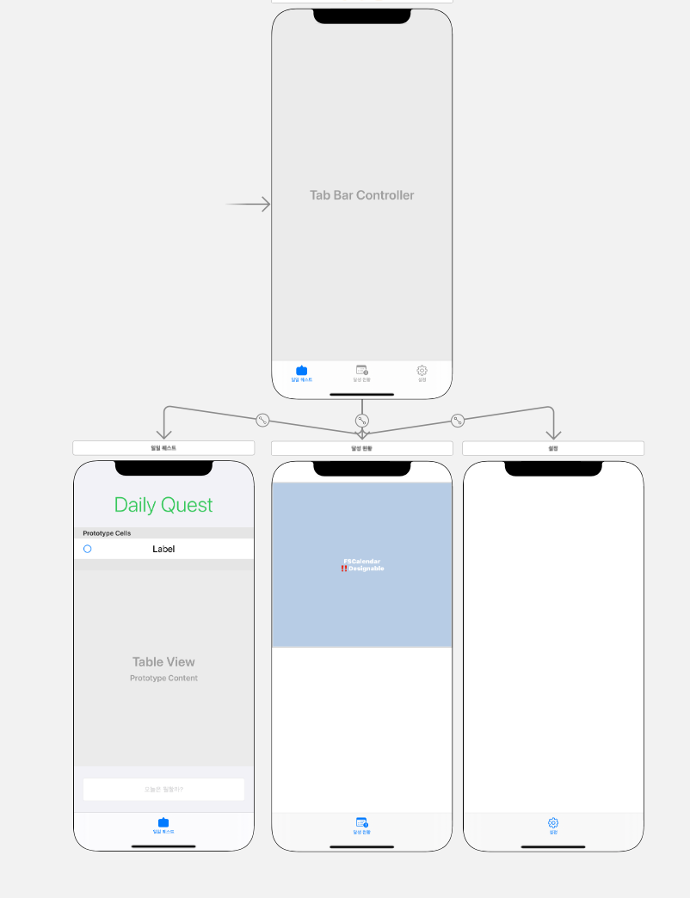

---

title: "[][Swift] [iOS][Swift] 투두리스트 앱 - UI 구성 AutoLayout Constraint 걸기"

subtitle: UI 구성 및 오토레이아웃 설정 UI & Constraint AutoLayout

tags: Swift, IOS, Constraint, AutoLayout

published: false

---

# 1. 결과 화면 

# 2. 레이아웃 구성

- `Tab Bar` 로 뷰 전환 ( 메인, 캘린더(미정), 설정 )
- 스택 뷰를 활용해 뷰를 나눔
- 
