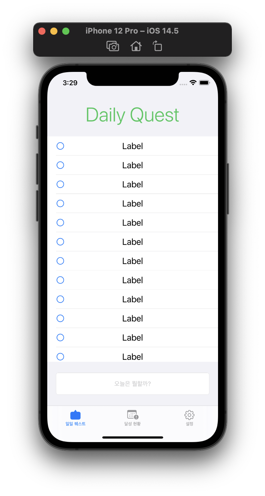
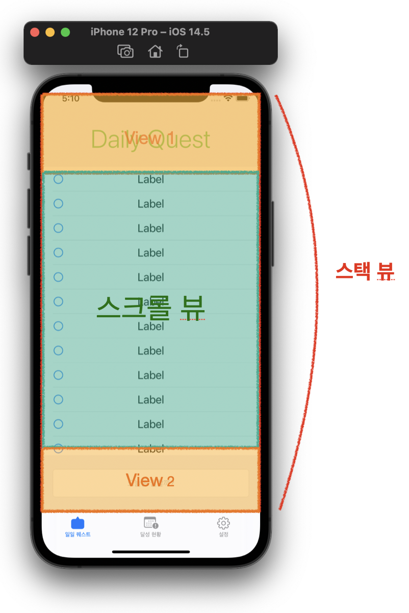
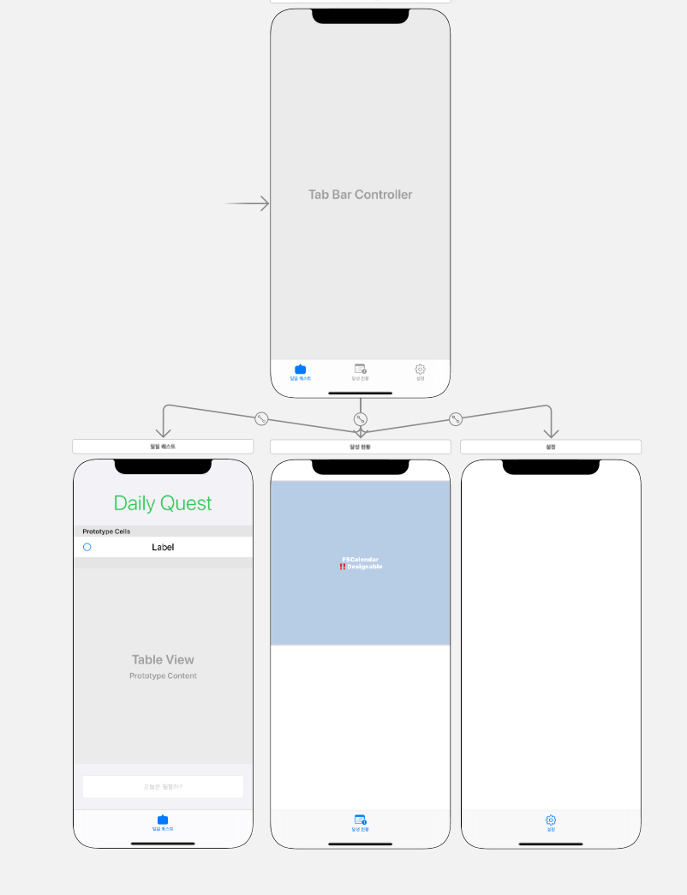
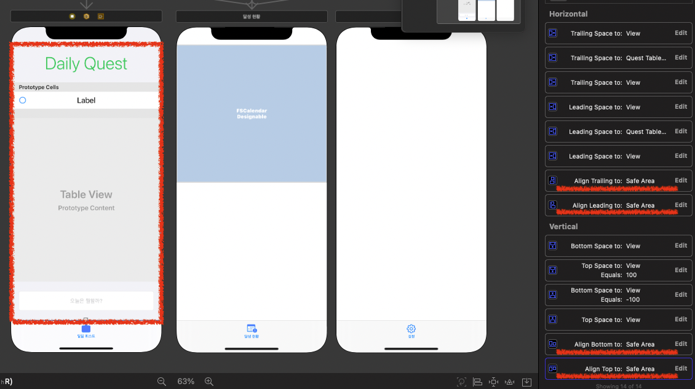
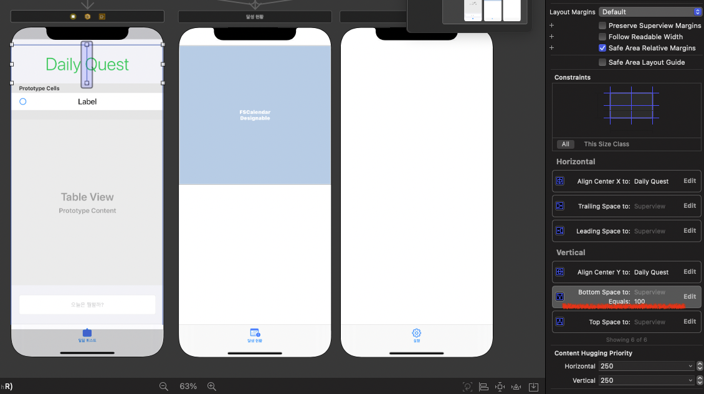
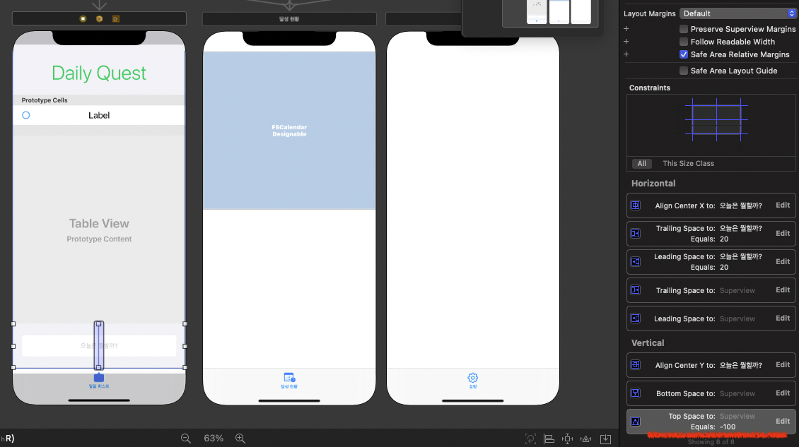

---

title: "[][Swift] [iOS][Swift] 투두리스트 앱 만들기 - UI 구성 AutoLayout Constraint 걸기"

subtitle: iOS ToDoList App UI - Constraint AutoLayout

tags: Swift, IOS, TodoList, Constraint, AutoLayout

published: true

---

# 1. 결과 화면 



# 2. 레이아웃 구성

# 3. 구현 할 기본 기능

- 투두리스트 조회
- 투두리스트 등록 및 삭제
- 투두리스트 완료 체크

# 4. AutoLayout

스택뷰는 `Safe Area` 에 딱 맞춰줍니다.

위에있는 뷰의 Bottom 을 `Superview` 의 Top 부분으로부터 100 만큼 떨어지도록 제약을 걸어 어떤 사이즈가 와도 항상 같은 크기를 유지할 수 있도록 해줍니다.

아래 뷰는 윗 뷰 설정과는 반대로 아랫뷰의 Top 을 `Superview` 의 Bottom 으로부터 -100만큼 떨어지도록 제약을 걸어서 맨 아랫부분으로부터 항상 100만큼 떨어지도록 해줍니다.

이렇게 설정하면 자연스레 남은 부분은 Table View 의 차지가 됩니다.
